<div id="top"></div>

<!-- PROJECT SHIELDS -->
<!--
*** I'm using markdown "reference style" links for readability.
*** Reference links are enclosed in brackets [ ] instead of parentheses ( ).
*** See the bottom of this document for the declaration of the reference variables
*** for contributors-url, forks-url, etc. This is an optional, concise syntax you may use.
*** https://www.markdownguide.org/basic-syntax/#reference-style-links
-->
[![Contributors][contributors-shield]][contributors-url]
[![Forks][forks-shield]][forks-url]
[![Stargazers][stars-shield]][stars-url]
[![Issues][issues-shield]][issues-url]


<!-- PROJECT LOGO -->
<br />
<div align="center">

<h3 align="center">OC - PROJECT N°4 - CHESS GAME TOURNAMENT TRACKER</h3>

  <p align="center">
    Track Players' Scores during a Chess Game tournament: 8 players / 4 rounds / 16 matches.
    <br/>
    <a href="https://github.com/Jliezed/oc_project_4_chess_game"><strong>Explore the docs »</strong></a>
    <br />
    <br />
    <a href="https://github.com/Jliezed/oc_project_4_chess_game">View Demo</a>
    ·
    <a href="https://github.com/Jliezed/oc_project_4_chess_game/issues">Report Bug</a>
    ·
    <a href="https://github.com/Jliezed/oc_project_4_chess_game/issues">Request Feature</a>
  </p>
</div>


<!-- TABLE OF CONTENTS -->
<details>
  <summary>Table of Contents</summary>
  <ol>
    <li>
      <a href="#about-the-project">About The Project</a>
      <ul>
        <li><a href="#built-with">Built With</a></li>
      </ul>
    </li>
    <li>
      <a href="#getting-started">Getting Started</a>
      <ul>
        <li><a href="#installation">Installation</a></li>
      </ul>
    </li>
    <li><a href="#outputs">Outputs</a></li>
    <li><a href="#contact">Contact</a></li>
    <li><a href="#acknowledgments">Acknowledgments</a></li>
  </ol>
</details>


<!-- ABOUT THE PROJECT -->
## About The Project

### Main Menu of the Chess Game Tournament Tracker:
- `Creation` : Add a new Player or Tournament in the database
- `Database` : Display Player or Tournament information
- `Tournament Tracker` : Enter to Tournament Tracker Menu for a specific Tournament saved in the database
- `Reset`: Reset the Database (Players and Tournaments Tables)

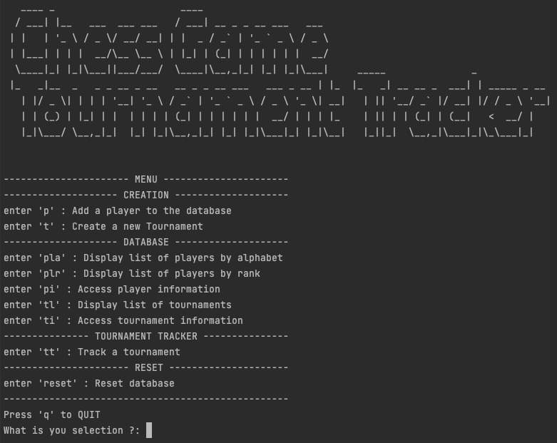


*enter 'pla' : Display list of players by alphabet*  
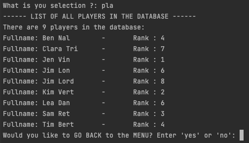

*enter 'plr' : Display list of players by rank*  
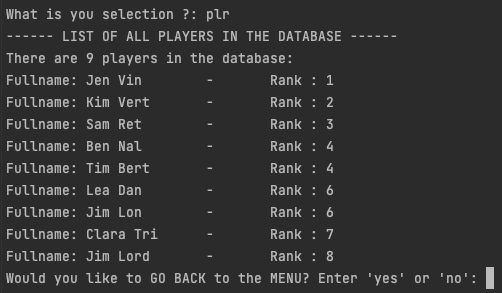

*enter 'pi' : Access player information*  
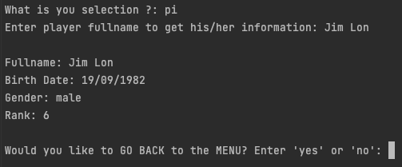

*enter 'tl' : Display list of tournaments*  
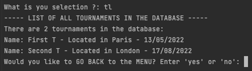

*enter 'ti' : Access tournament information*  
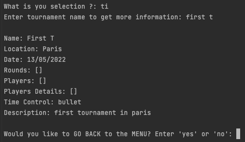


### Tournament Tracker Menu :
- `Players` : Add player to the tournament, display info, modify rank and remove player
-> Add 8 players to the tournament to start record scores

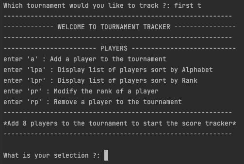


### Tournament Tracker Menu - Start Record : 
When 8 players added to the tournament, records can be started:
- `Players` : 
  - Display players information
  - Modify rank, only available if "record" of the first round not yet saved in the database
  - Reset Players
- `Start Rounds` : enter scores for each matches of each rounds (4 matches per round)
- `Results` : display tournament results when all rounds recorded
- `Reports` : get more information about rounds and matches


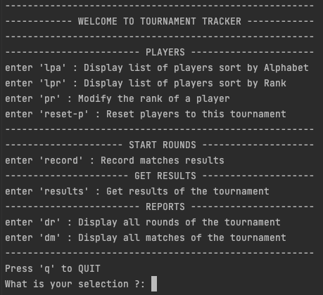


*enter 'record' :  
-Start generate Rounds and Matches*  
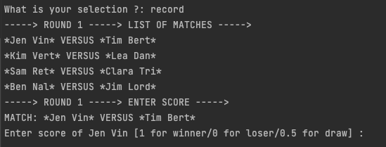

*- Enter scores for each match*  
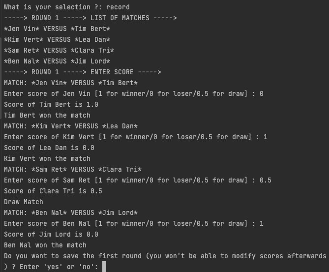

*Enter 'results': Get results of the tournament*  
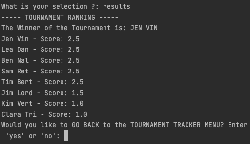


<p align="right">(<a href="#top">back to top</a>)</p>


### Built With

* [Python](https://www.python.org/)
* [Library Datetime](https://docs.python.org/3/library/datetime.html)
* [Library TinyDB](https://tinydb.readthedocs.io/en/latest/)

<p align="right">(<a href="#top">back to top</a>)</p>


<!-- GETTING STARTED -->
## Getting Started

### Installation & Running the script

1. Clone the repo
   ```sh
   git clone https://github.com/Jliezed/oc_project_4_chess_game.git
   ```
#### Create and activate a virtual environment
2. Go to your project directory
   ```sh
   cd /oc_project_4_chess_game
   ```
3. Install venv library (if not yet in your computer)
   ```sh
   pip install venv
   ```
4. Create a virtual environment
   ```sh
   python -m venv env
   ```
5. Activate the virtual environment
   ```sh
   source env/bin/activate
   ```
---
6. Install the packages using requirements.txt
   ```sh
   pip install -r requirements.txt
   ```
7. Run the script using the terminal
   ```sh
   python main.py
   ```
---
8. Generate a new Flake8 report
   ```sh
   flake8 --format=html --htmldir=flake-report
   ```


<p align="right">(<a href="#top">back to top</a>)</p>


<!-- USAGE EXAMPLES -->
## Database Outputs - JSON file

The program generate a JSON file to keep track of players and tournaments information :
- in progress


<p align="right">(<a href="#top">back to top</a>)</p>


<!-- CONTACT -->
## Contact

Jliezed

Project Link: [https://github.com/Jliezed/oc_project_4_chess_game](https://github.com/Jliezed/oc_project_4_chess_game)

<p align="right">(<a href="#top">back to top</a>)</p>


<!-- MARKDOWN LINKS & IMAGES -->
<!-- https://www.markdownguide.org/basic-syntax/#reference-style-links -->
[contributors-shield]: https://img.shields.io/github/contributors/Jliezed/oc_project_4_chess_game.svg?style=for-the-badge
[contributors-url]: https://github.com/Jliezed/oc_project_4_chess_game/graphs/contributors
[forks-shield]: https://img.shields.io/github/forks/Jliezed/oc_project_4_chess_game.svg?style=for-the-badge
[forks-url]: https://github.com/Jliezed/oc_project_4_chess_game/network/members
[stars-shield]: https://img.shields.io/github/stars/Jliezed/oc_project_4_chess_game.svg?style=for-the-badge
[stars-url]: https://github.com/Jliezed/oc_project_4_chess_game/stargazers
[issues-shield]: https://img.shields.io/github/issues/Jliezed/oc_project_4_chess_game.svg?style=for-the-badge
[issues-url]: https://github.com/Jliezed/oc_project_4_chess_game/issues
[license-shield]: https://img.shields.io/github/license/Jliezed/oc_project_4_chess_game.svg?style=for-the-badge
[license-url]: https://github.com/Jliezed/oc_project_4_chess_game/blob/master/LICENSE.txt
[linkedin-shield]: https://img.shields.io/badge/-LinkedIn-black.svg?style=for-the-badge&logo=linkedin&colorB=555
[linkedin-url]: https://linkedin.com/in/linkedin_username
[product-screenshot]: images/screenshot.png